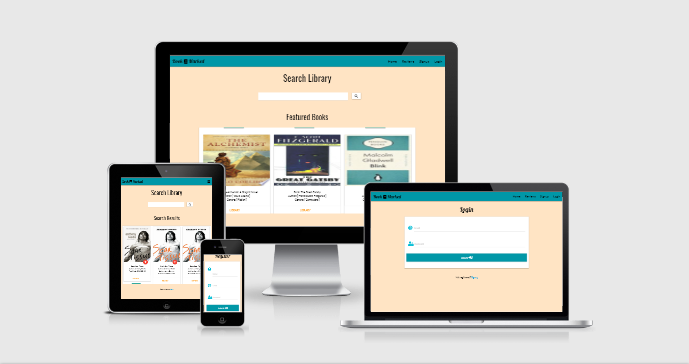

# Book Marked

I am designing this web application as part of my third Milestone project for Code Institutes diploma in software development course. This application was designed to be both a search engine to discover new books as well as a digital library to save titles that you would like to or have already read. The site also has a review feature where you can review searched and featured books. You can find the deployed website [here](https://bookmarked-db.herokuapp.com/home)

# UX
## User Stories
As a user I would like:

* To have access to a wide variety of books from all genres.
* To be able to create a user profile on the BookMarked web page.
* To be able to securely login to my profile.
* To be able to logout of my profile.
* To be able to add books I'm interested in to my user profile.
* To be able to remove books from my profile.
* To have clear and easy navigation throughout the page.
* To be able to search a database of books.
* To have a section of featured books as examples.
* To have a link to view more info on the book shown.
* To be able to review any book.
* To be able to view reviews left by other users.

## Strategy
This page was designed with readers in mind. This page should be an easy and enjoyable experience for anyone that visits. Other websites that provide the same or similar service were reviewed by my self in order to know what customers are looking for. This helped me to figure out which features were most important for my site.

## Scope
The main objective of this project was to make sure the user needs were meet. The design was simplistic so that I could focus on the functionality of the webpage rather than the look of it. Making sure it was easy for the user to sign up, login and logout was also essential to providing a good service with this web page. Users will visit this site to discover new books, save them to their library and possibly review them upon completion. This can all be done quickly and efficiently on the BookMarked website. Some features such as updating a profile picture or contacting a support system for the web page will have to be implemented some time in the future due to limited time.

## Structure
The Book Marked web page was designed to navigate with ease. Its simple and familiar layout allows the user an enjoyable and fun experience. The navbar in the top corner allows for easy movement throughout the web page as well as additional navigation links on the bottom of the profile, sign up and login pages. The books are the focus of the webpgae, so they take up most of the space on the home and profile pages. The books are contained in a card panel with a scroll bar which allows for a clean and simple way to view the searched and featured books. All of these easy navigation tools and other features are to allow for optimal user experience.

## Skeleton
There was no real theme to the design of the web page but I did aim to give a certain feel to it. I aimed to use very inviting and almost relaxing colors throughout the page. The colors and layout were designed to draw users in and hopefully keep them coming back. The design of the page allowed for the sections containing books(e.g featured books, searched books) to really stand out as these books are the whole reason for the users visit. The design will be discussed further in the design section of this document.

## Design
**Wire Frames**

 The web page was designed using Balsamiq to create some basic wire frames. The design of the page really evolved from the basic wire frames as it came together so the actual website slightly differs from the original designs(Link below).

 [wire frames](wireframes.md)
 

**Colors**
* The main colors I used were teal and a beige(bisque) background. I felt these were very neutral and inviting colors that allowed the rest of the content to stand out.  

* I left all the text the same shade of black as it really stood out from the back round. This is excluding some of the built in materialized links which are orange and other nav links that are blue. I decided to leave them this way as I thought they really suited the style of the page.

**typography**
* For most of the headings on the web page I used 'Lobster', cursive. I chose this so the web page wouldn't look too bland. I feel this font added a fun element to the website.

* The rest of the web page either 'Oswald', sans-serif or 'Lato', sans-serif were used as the paired nicely with the Lobster and made all the text very visible.

# Features
## Existing Features
* Navabar with links to each page of the web application which can be found in the top right corner.
* Registration form for users to create a BookMarked profile.
* Login form for users to login to their profile.
* A library where users can add books they would like to read from searched books or featured books.
* A search engine to look through a database of books which can be reviewed or saved(BookMarked).
* A list of featured example books which can be reviewed or saved(BookMarked).
* A review page with a form that allows you to leave a rating and comment on different titles.
* You can read reviews left by other users.
* A link to the books profile on google books.

## Features Still to Be Implemented
* Upload an avatar/sticker/emoji for the user image.
* To be able to tick off books that you have completed in your library. This would give users another reason to visit the site.

# Technologies Used
## Languages
* [HTML5](https://en.wikipedia.org/wiki/HTML5)
* [CSS3](https://en.wikipedia.org/wiki/CSS)
* [JavaScript](https://javascript.info/)
* [Python](https://www.python.org/download/releases/3.0/)
* [MongoDB](https://www.mongodb.com/)
* [Flask](https://flask.palletsprojects.com/en/1.1.x/)

## Frameworks and Programs

* [Balsamiq](https://balsamiq.com/wireframes/?gclid=Cj0KCQiA48j9BRC-ARIsAMQu3WSc14tIkeDZUlWDIVOa-Acbyn1s5XvsJJ6CnWplwD7_WPcgk-C4cTgaAsaNEALw_wcB)
> I used Balsamiq to make my wire frames.

* [GitHub](https://github.com/)
> GitHub was used to push content to the repository.

* [W3C CSS Validator](https://jigsaw.w3.org/css-validator/validator)
> CSS code was checked using CSS W3C CSS Validator.

* [Online Beautifier](https://beautifier.io/)
> Online Beautifier was used to beautify my HTML, CSS and JavaScript code.

* [W3C Markup Validator](https://validator.w3.org/nu/#textarea)
>W3C Markup Validator was used to check the HTML code.

* [Google Fonts](https://fonts.google.com/)
>All fonts came from Google Fonts.

* [Flask](https://flask.palletsprojects.com/en/1.1.x/)
>Framework used to build the backend with python.

* [Materialize](https://materializecss.com/)
>Materialized used for the design, layout and responsiveness of the page.

* [Wt forms](https://wtforms.readthedocs.io/en/2.3.x/)
>Wt forms was used for the back end validation of my login and sign up forms.

* [Google books API](https://developers.google.com/books/docs/v1/reference#resource_volumes)
>All the book data was retrieved from Google books API.

# Testing

Most of the testing can be found on my TESTING.md document which can be found [here](TESTING.md).

## Browser Compatibility Test
Nm | Browser | Action | Test result |
-- | ------- | ------ | ----------- |
#1 | Chrome | Open app in browser. | Pass |
#2 | Firefox | Open app in browser. | Pass |
#3 | Safari | Open app in browser. | Pass |

## Deployment

## On github repository
* Use pip3 to install all modules.

* Create an env.py file and make sure it is listed in your.gitignore file. Input all your important secret variable into this file e.g API_key, SECRET_KEY.

* Enter this at the top of your python app file - if os.path.exists("env.py"): import env.

* For each environmental variable, define the variables in the app.py file

* When all the necessary modules are installed and the env.py file is complete, your Requirements.txt file and list all the modules by entering this into the terminal - pip3 freeze --local > requirements.txt

* Create a Procfile that will tell Heroku how to run your app - echo web: python app.py > Procfile

* Git add, commit and push all your changes to the github repository.

## Heroku
* Sign into a Heroku account

* Click on New button to create a new app with a unused name.

* Next select the app and then click on Settings in menu.

* Find "Config Vars" section and click on the "Reveal Config Vars" button.

* In the input boxes for each variable (API Key, database url, port, Secret Key, database name, and IP) input key and value and then hit add.
Once all variables have been input, click on "Deploy" in menu bar.

* In the Deployment Method section, select GitHub

* Type in the repository name and if the name of the repo is found you will be able to click connect on said repo.

* The app will then be connected to the GitHub repository.

* To enable automatic deployment, scroll down to "Automatic Deploys" section and click on button "Enable Automatic Deploys."

* Go to Settings and scroll down to find Domains and you will find your web address e.g - https://bookmarked-db.herokuapp.com/home

* After instigating automatic deployment, all changes committed to the GitHub repository will be reflected in the deployed site on Heroku.

## How to clone this project
## With Gitpod
* Create a Gitpod account and install Gitpod Browser extension for chrome.
* Log into your gitpod account.
* Go to [Github repository](https://github.com/LiamGaff/Book-Marked) and click on the green "Gitpod" button.
* This will open a new Gitpod workspace created from the code in the github repository where you can work.

## Local IDE
* Go to my Github repository [here](https://github.com/LiamGaff/Book-Marked).
* Under the repository name click on "clone or download"
* In the clone with HTTPs section copy the clone URL for the repository.
* In your local IDE open the terminal and change your directory to where you want the clone to be made.
* In the terminal type _git clone_ and then paste the repository URL.
* Press enter and a clone will be created.

# Credits

## Code
* W3 School and StackFlow were greatly used throughout this project.

* The backend form validation witch wt forms was found on pretty printed Youtube tutorials.

* Flaskpalletsprojects.com for guidance when I got stuck with flask related questions.

* In order to build the search engine and retrieve any book data google books API was used.

## Acknowledgments
* I would also like to credit and thank my mentor Brian Macharia for all his help and excellent guidance throughout this project. Also Eoin O'Neill who also reviewed my work and was a huge help.

* I would like to thank my tutors and the slack community for all the help they provided me with.